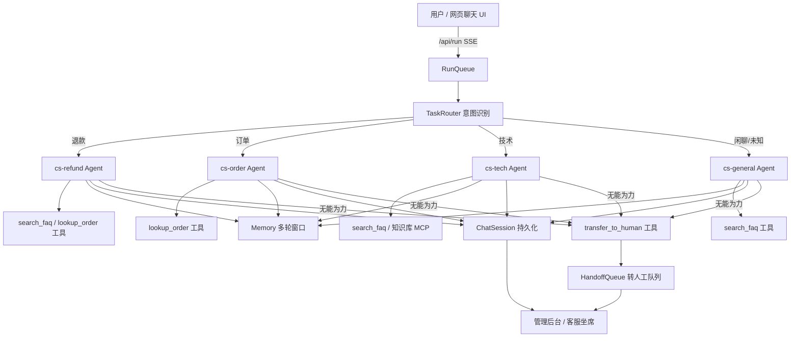

# 智能客服 Agent 应用 · 设计方案与框架接入计划

> 目标：基于当前 `agent-harness` monorepo，构建一个支持「多轮对话 / FAQ 检索 / 意图识别（退款·订单·技术）/ 自动转人工 / 对话持久化 / 管理后台（记录+满意度）」的智能客服 Agent。
> 本文仅给出**设计方案与框架接入方案**，不含代码实现。

## 0. 结论速览

你的框架已原生覆盖 6 项需求中的 4 项，另 2 项（FAQ 检索、转人工）只需新增「工具 + 少量服务端/前端扩展」即可接入，**几乎不改动核心循环**。映射如下：

| 需求 | 框架现状 | 接入方式 |
|------|----------|----------|
| 多轮对话 | ✅ Memory 窗口 + 会话级缓存 + 前端多会话 UI | 直接用，配置 systemPrompt |
| 对话历史持久化 | ✅ `ChatSession` 存储 + `CHAT_SESSIONS_FILE` + 已建 CRUD 接口 | 扩展字段；生产换共享后端 |
| FAQ 知识库检索 | 工具机制 `ToolRegistry` + 检索型 trace 高亮 | 新增 `search_faq` 工具（或 FAQ-MCP）|
| 意图识别（退款/订单/技术）| ✅ `IntentRouter` + `TaskRouter` 路由引擎 | 注册 3 张领域 AgentCard + CS 意图词典 |
| 自动转人工 | 工具机制 + 护栏/verify | 新增 `transfer_to_human` 工具 + 服务端启发式升级 |
| 管理后台（记录+满意度）| ✅ 会话列表/详情接口 + RBAC + 前端面板框架 | 新增满意度字段/统计接口 + `ah-cs-admin` 面板 |

---

## 1. 需求与框架能力映射（含代码定位）

### 1.1 多轮对话 —— 已具备
- 核心：`packages/core/src/harness.ts` 的 `AgentHarness.run()` 把每轮 user/assistant/tool 追加进 `Memory` 窗口；`packages/server/src/runner.ts` 的 `getSessionMemory(sessionKey)` 按 `sessionKey` 复用同一 `Memory` 实例，使同一会话多次 `/api/run` 共享上下文（LRU 有界缓存）。
- 前端：`packages/webapp/src/chat.ts`（`ah-chat`）已是三栏多会话聊天 UI，按 `chatSessionId` 隔离、可并发流式、可跨刷新恢复。
- **接入**：前端调用 `/api/run` 时稳定携带 `sessionId`（= 记忆 key）与 `chatSessionId`（= 会话存储 key），沿用既有机制即可。

### 1.2 对话历史持久化 —— 已具备，生产需升级后端
- `packages/server/src/chat-sessions.ts`：`ChatSession` 模型（id/title/createdAt/updatedAt/messages[]），消息含 `role/content/ts/reasoning/tools/trace`。
- 接口已存在（`server.ts`）：`GET/POST /api/chat/sessions`、`GET/PATCH/DELETE /api/chat/sessions/:id`。
- 服务端 `handleRun` 已在 `run:start`/`run:end` 自动把 user/assistant 消息落盘到该存储（含推理/工具/链路）。
- **缺口**：当前是「进程内存 Map + 可选单 JSON 文件（`CHAT_SESSIONS_FILE`）」。生产多副本需改为共享后端（sqlite/redis），与 `MemoryStore`（`packages/core/src/memory-store.ts`）同款思路。

### 1.3 FAQ 知识库检索 —— 新增工具
- 工具机制：`packages/core/src/tools.ts` 的 `ToolRegistry.register(name, description, parameters, fn)`。agent 在 harness 循环里自主决定调用。
- 检索型工具在 `server.ts` 的 `RETRIEVAL_RE` / `chat.ts` 的 `isRetrievalTool` 会被识别为 `retrieval` 节点并绿色高亮——命名含 `search/query/lookup/knowledge` 即可自动获得好看的检索卡片。
- **实现**：新增 `search_faq(query, topK?)` 工具，后端查 FAQ 库（JSON 或向量库）。也可把 FAQ 作为远程 MCP server 接入（框架已支持多 MCP，`mcpManager`）。

### 1.4 意图识别（退款/订单/技术）—— 已具备路由引擎，需补 CS 词典
- `packages/core/src/router/intent.ts`：`IntentRouter.classify(prompt)` → `{domain, intent, requiredCapabilities, source}`，支持 rule（关键词）/ llm（`INTENT_ROUTER=llm`）/ auto（智能降级：有 key 用 llm，无 key 用 rule）。
- `packages/core/src/router/router.ts`：`TaskRouter.resolve()` 决策优先级：显式 agentId > domain > classify > fallback，返回 `RouteResult{agentId, card, decidedBy, intent}`。
- **接入**：新增 CS 领域词典与 3 张领域 AgentCard（`cs-refund`/`cs-order`/`cs-tech`），`/api/run` 带 `domain:'cs'`（或固定 `agentId:'cs-orchestrator'`）即由路由引擎分派；命中意图经 `run:meta.decidedBy`/`intent` 透出，可落库做统计。

### 1.5 自动转人工 —— 新增工具 + 服务端升级
- **模型驱动**：新增 `transfer_to_human(reason, summary)` 工具，agent 在「无能为力」时调用。
- **服务端启发式升级（兜底，防模型不调用）**：达到 maxSteps 仍未解决 / 连续 N 次工具失败或护栏拦截 / 命中「人工客服」关键词 / verify 未通过 → 自动触发 handoff。
- **落库**：`ChatSession` 增 `handoff` 字段；SSE 增 `handoff` 事件供前端提示「已转接人工」；管理后台增「待接入队列」。

### 1.6 管理后台（记录+满意度）—— 扩展接口 + 前端面板
- 数据接口已具备；需新增：满意度字段 + `POST /api/chat/sessions/:id/feedback`；统计聚合 `GET /api/cs/stats`；转人工队列 `GET/POST /api/cs/handoffs`。
- 前端：`packages/webapp/src/panels.ts` 已用 LitElement 面板模式（`ah-verify`/`ah-env`/`ah-mcp`/`ah-approvals`），新增 `ah-cs-admin` 面板即可；纳入 `app.ts` 的 Tab 栏，受 RBAC（`sessions:read` 或新 `cs:admin`）保护。

---

## 2. 智能体总体设计

### 组件
1. **cs-orchestrator（默认入口 agent）**：接待、闲聊、做意图初判；通过 `TaskRouter` 把明确意图转给专营 agent。
2. **cs-refund / cs-order / cs-tech（领域 agent）**：各自 `assembly:{ systemPrompt, tools }` 收窄到该意图。
   - `cs-order` 需「查订单」能力：新增 `lookup_order(order_id)` 工具（或订单系统 MCP）。
   - `cs-tech` 需「查文档/报错」能力：`search_faq` + 可选知识库 MCP。
3. **FAQ 检索工具（共享）**：`search_faq`。
4. **转人工工具**：`transfer_to_human`。

---

## 3. 当前框架接入方案（按文件给出）

### 3.1 注册客服 Agent（core/agents）
- 在 `packages/core/src/agents/types.ts` 的 `IndustryDomain` 联合类型补充客服域（如 `'cs-refund'|'cs-order'|'cs-tech'|'cs-general'`），或在 `router/intent.ts` 的 `DOMAIN_KEYWORDS` 增加客服词表（退款/退货/订单/物流/故障/报错…）。
- 用 `getAgentRegistry().register(card)` 注册 3–4 张 `AgentCard`，每张 `assembly:{ systemPrompt, tools, skills }` 收窄到该意图；或在服务端 bootstrap 时 seed（沿用 `initAgentRegistry` 持久后端）。
- 前端 `/api/run` 传 `agentId:'cs-orchestrator'`（或 `domain:'cs'`），`run-queue` 经 `resolveTask` 自动路由。

### 3.2 FAQ 检索工具（core/tools 或独立包）
- `tools.register('search_faq', '检索 FAQ 知识库…', {type:'object', properties:{query, topK}}, async (args)=>{ … })`。
- 后端：v1 用 JSON 文件（问题/答案/关键词/ embedding 可选）；后续可换向量库（pgvector / 本地 embeddings）。命名含 `search` → 前端自动绿色检索卡片。

### 3.3 转人工工具 + 服务端升级（server）
- 新增工具 `transfer_to_human`，其 `fn` 把 handoff 写入当前 `ChatSession.handoff` 并推入 `HandoffQueue`（可用回调/事件桥接，不破坏 harness 主循环）。
- 在 `handleRun` 的订阅逻辑里：监听 harness `run:end`，结合 `maxSteps`/失败次数/verify 结果做启发式升级；命中则发 `handoff` SSE 事件并落库。

### 3.4 数据模型扩展（chat-sessions.ts）
- `ChatMessage` 增 `intent?: string`、`satisfaction?: { rating:number, comment?:string, at:number }`。
- `ChatSession` 增 `intent?: string`、`handoff?: { at, reason, summary, status, claimedBy? }`、`resolved?: boolean`、`channel?: string`。
- 新增 `HandoffQueue` 轻量存储（同进程 Map + 可选持久化），或复用 ChatSession 列表按 `handoff` 过滤。

### 3.5 新增接口（server.ts）
- `POST /api/chat/sessions/:id/feedback` — 记录满意度。
- `GET /api/cs/stats` — 聚合：总会话、已解决/已转人工、意图分布、平均满意度、CSAT%、按日趋势。
- `GET /api/cs/handoffs` + `POST /api/cs/handoffs/:id/claim` — 转人工队列与认领。
- 均接入既有 `guard()` RBAC（建议新动作 `cs:read`/`cs:admin`）。

### 3.6 前端
- `chat.ts`：`run:end` 后展示 👍/👎（或 1–5 星）评分条 → `client.rateSession(id, rating)`。
- `panels.ts` 新增 `ah-cs-admin`：会话列表（按意图/转人工/日期筛选）、详情（复用 chat 渲染）、满意度概览、统计卡片（轻量柱状/饼图，纯 SVG 或现成 chart）。
- `app.ts` 增加「客服管理」Tab（受 `cs:admin` 角色显示）。

---

## 4. 部署与配置
沿用现有 Docker / compose / k8s（`deploy/` 目录已齐备）。新增环境变量：
- `INTENT_ROUTER=llm`（意图精度）、`MEMORY_BACKEND=sqlite`、`CHAT_SESSIONS_FILE=/data/cs-sessions.json`
- `CS_AGENT_ENABLED=true`、`FAQ_SOURCE=file|vector`、`CS_HANDOFF_WEBHOOK=https://...`（转人工时通知企微/飞书）
- 多副本：记忆与 ChatSession 均挂 RWX 卷或共享 redis（参考 `deploy/k8s` 的 RWX PVC 方案）。
- 鉴权：设 `UI_AUTH_TOKEN` 与 `AUTH_PROVIDER=oidc`；管理后台仅对 `admin` 角色可见。

---

## 5. 实施路线图（哪些现成、哪些新建）
- **阶段 0（0 成本验证）**：mock 模式 + 现有 chat UI + 注册一张 cs 通用 AgentCard（带 `search_faq` 工具）跑通「多轮 + FAQ + 持久化」。
- **阶段 1（意图路由）**：补 CS 词典 + 3 张领域卡，开 `INTENT_ROUTER=llm`，验证退款/订单/技术分派。
- **阶段 2（转人工）**：`transfer_to_human` 工具 + 启发式升级 + handoff 队列 + SSE 事件。
- **阶段 3（管理后台）**：满意度字段/接口 + 统计接口 + `ah-cs-admin` 面板 + RBAC。
- **阶段 4（生产化）**：ChatSession 共享后端、向量 FAQ、订单系统 MCP、企微/飞书通知、k8s 多副本。

---

## 6. 风险与建议
- **多副本会话一致性**：`ChatSession` 当前是单文件/内存，多副本需先升级后端（参考 `MemoryStore` 的 sqlite/redis 实现）。
- **意图误分**：rule 词典易漏，建议 `INTENT_ROUTER=llm` + 缓存；兜底 default 卡兜底。
- **转人工误触/漏触**：以「模型工具 + 服务端启发式」双保险，并以 handoff 队列人工可干预。
- **PII**：客服对话含隐私，复用 `guardrails.ts` 的 `redactOutput` 与 `retention.ts` 的留存策略做脱敏与留存期限。
