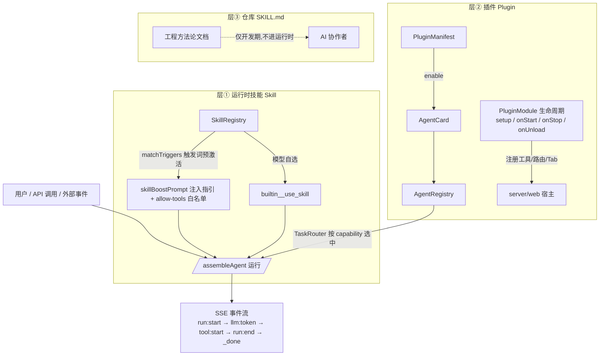
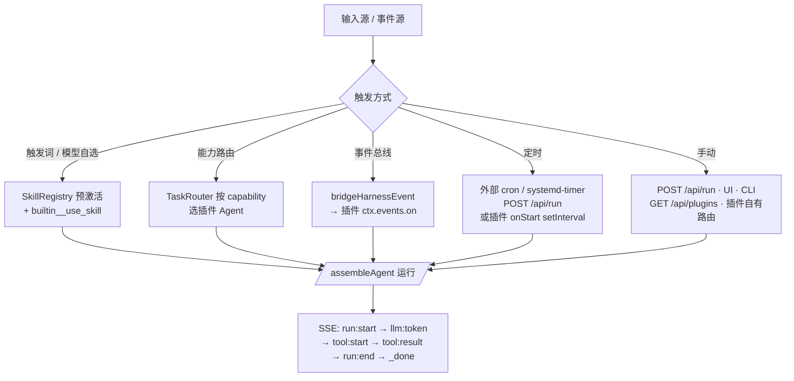

# agent-harness 技能开发 · 外部接入 · 触发机制 —— 技术方案与落地指引

> 适用仓库：agent-harness（pnpm monorepo，分层布局）
> 核心锚点：`backend/core/src/skills/index.ts`、`backend/core/src/plugin/*`、`access/server/src/runner.ts`、`access/server/src/plugin-bootstrap.ts`、`access/server/src/server.ts`

---

## 0. 结论速览

本项目实际存在 **三层「技能」体系**，各有明确分工，先选对层再动手：

| 层 | 载体 | 代码锚点 | 何时用 |
|---|---|---|---|
| ① 运行时技能（Skill） | `Skill` 接口 + `SkillRegistry` | `backend/core/src/skills/index.ts` | 给**已有 agent** 增加"工具 + 执行指引 + 触发词"的轻量复合能力，不想要独立生命周期 |
| ② 插件（Plugin） | `PluginManifest → AgentCard → Registry` | `backend/core/src/plugin/{manifest,loader,context,module}.ts` | 需要独立生命周期（install/enable/disable/upgrade/uninstall）、专属工具、HTTP 路由、前端 Tab、A2A/工作流接入的**重量级能力包** |
| ③ 仓库 SKILL.md | `skills/<name>/SKILL.md` | `skills/ah-platform-evolution/` | **开发期**给 AI 协作者用的工程方法论文档，不进运行时，无需注册 |

**决策规则**：只加一段"什么场景用什么工具"的提示词 → ①；要新增一个可路由、可管理、可独立启停的 agent 能力 → ②；只是沉淀开发流程知识 → ③。

### 0.1 三层体系架构图（Mermaid）



术语对齐：本文与 `docs/03-plugins/定时触发演示与说明.md`、`docs/03-plugins/技能体系落地执行报告.md` 中的「层①②③」「触发词/能力路由/事件/定时」「插件生命周期」均指同一概念，措辞保持一致。

---

## 1. 技能开发（层①：SkillRegistry）

### 1.1 接口规范

`Skill` 接口（`backend/core/src/skills/index.ts:12-27`）：

| 字段 | 类型 | 必填 | 说明 |
|---|---|---|---|
| `id` | `string` | ✅ | 唯一标识；模型经 `builtin__use_skill` 的 `skill` 参数引用 |
| `title` | `string` | ✅ | 人类可读名称 |
| `description` | `string` | ✅ | 何时/为何使用；注入系统提示词供模型判断选用 |
| `triggers` | `string[]` | 可选 | 触发词；用户消息包含其一即自动预激活（大小写不敏感） |
| `tools` | `string[]` | 可选 | 关联工具名（提示与展示用，不强制门控） |
| `prompt` | `string` | 可选 | 激活时注入的执行指引；缺省回退 `description` |
| `enabled` | `boolean` | 可选 | 默认 `true` |

### 1.2 开发与注册步骤

1. **写技能**：在 `defaultSkills()`（`skills/index.ts:99`）数组中追加一个 `Skill` 对象；或构造独立 `SkillRegistry` 实例批量 `registerMany()`。
2. **确认关联工具已注册**：`tools` 里引用的工具必须是内置工具（`BUILTIN_TOOL_NAMES`）或插件工具（`<pluginId>__<tool>`），否则模型激活技能后无工具可用。
3. **按 agent 收窄启用面**：通过 `AgentAssembly.skills: string[]`（`agents/types.ts:53-54`）指定该 agent 仅启用哪些 skill id——`undefined`=全部默认技能、`[]`=一个不启用。
4. **运行时装配**（`access/server/src/runner.ts:294-306`，`assembleAgent` 内）：每次运行构造 per-run `SkillRegistry` → 按 assembly 过滤 `defaultSkills()` → `registerMany` → `registerSkillTools(tools, skillRegistry)` 注册 `builtin__use_skill` 元工具。

### 1.3 生命周期

技能是**无状态、随运行装配**的：没有 install/uninstall，生命周期 = 一次 `assembleAgent` 运行。启停 = 修改 `enabled` 或调整 `AgentAssembly.skills` 过滤条件，重启/下次运行即生效。

---

## 2. 插件开发与注册（层②：Plugin 系统）

### 2.1 PluginManifest 字段规范（`plugin/manifest.ts`）

| 字段 | 说明 |
|---|---|
| `id` | 唯一插件 id，同时作为注册进 Registry 的 agentId（`pluginId === agentId === AgentCard.id`） |
| `version` | 语义化版本 `"x.y.z"` |
| `name` / `description` | 展示名 / 描述 |
| `capabilities` | 能力声明，启用时自动转成 `AgentCard.capabilities` 供路由发现 |
| `dependencies` | 依赖的其它插件 id（启用前必须已全部安装） |
| `permissions` | 权限声明（P2 配额/合规用，当前仅记录） |
| `transport` / `endpoint` | 接入传输方式；远端行业 agent 设 `transport: 'a2a'` + `endpoint` |
| `entry` | 隔离加载入口（如 `dist/index.js`） |
| `domain` | 行业域（合规画像 + 跨行业不可信隔离升级；缺省 `'generic'`） |
| `isolation` | 最低执行隔离级别：`'none' | 'local' | 'os' | 'container'`；不可信插件应声明 `'os'` 或 `'container'` |
| `assembly` | 装配配方（`AgentAssembly`）：收窄 systemPrompt / skills / mcpServers / tools / defaultMode |

### 2.2 PluginModule 生命周期钩子（`plugin/module.ts` + `loader.ts`）

```
install/installModule → enable → (run) → disable → upgrade / uninstall
```

| 钩子 | 时机 |
|---|---|
| `setup(ctx)` | enable 时最先调用；在 `ctx.tools` 注册插件工具、经 `ctx.server/web` 挂路由/视图 |
| `onStart(ctx)` | enable 时在 setup 后调用 |
| `onStop(ctx)` | disable 时调用；宿主对称撤回路由/Tab/工具 |
| `onUnload(ctx)` | uninstall 时调用；清理全部副作用 |

非侵入式铁律：插件**只通过 `PluginContext` 调用 core 公共 API**，绝不 import/修改 core 源码。

### 2.3 PluginContext 注入面（`plugin/context.ts`）

- `tools`：插件专属 ToolRegistry → enable 后 loader 自动合并进进程共享插件工具表，前缀 `<pluginId>__`（`mergePluginTools`，`loader.ts:364-371`）。
- `server`：挂 HTTP 路由，宿主收敛到 `/api/plugins/:pluginId/*`。
- `web`：注册前端 Tab（`PluginUIView.render(): string | Promise<string>`，webapp plugins-console 渲染）。
- `agentRegistry` / `router` / `workflow`（DAG）/ `a2a` / `events`（事件总线）/ `config` / `env` / `logger`。

### 2.4 开发步骤（可直接落地）

```bash
# 1. 脚手架（scripts/create-plugin.cjs）
node scripts/create-plugin.cjs my-skill-pack
# 2. 改 src/manifest.ts（对齐 plugins/customer-service/src/manifest.ts 写法）
# 3. 实现 src/tools/*、src/services/*、src/index.ts 默认导出 PluginModule
cd plugins/my-skill-pack && pnpm build && pnpm smoke
# 4. 全仓构建 + 测试
pnpm -r build   # 拓扑序 core → server/webapp/plugins
```

**接入运行时**（`plugin-bootstrap.ts`）：server 启动时经 `AGENT_PLUGINS`（逗号分隔 .js 入口绝对/相对路径）发现插件；未配置则回落默认客服/医美插件。每个入口应 `export default` 一个 `PluginModule`。单插件失败仅告警跳过，不拖垮主服务。

**注册闭环**：`installModule(mod)` → `enable(id)` → `manifest.capabilities` 转 AgentCard 注册进共享 `getAgentRegistry()` → 被 TaskRouter 选中、被 A2A 派发、被工作流引用，与核心 agent 走完全相同路径。

---

## 3. 外部技能接入（三种形态）

| 形态 | 接入方式 | 认证/鉴权 | 适用 |
|---|---|---|---|
| A. 远端 agent（A2A） | 清单声明 `transport:'a2a'` + `endpoint`，本地只持清单不持代码 | 网络层自管；`permissions` 声明；`isolation:'container'` | 第三方已在线的行业 agent 入驻 |
| B. 远程 registry 插件包 | `loader.installFromRegistry(client, PLUGIN_REGISTRY_URL, id, version, {verifySecret, scheme:'hmac'|'ed25519', autoEnable})` | **HMAC/Ed25519 签名校验**，验签失败抛错拒绝安装 | 从插件市场分发到本地执行的能力包 |
| C. 外部 MCP 工具 | `MCP_SERVERS` JSON 配置多个 server，工具前缀 `<server>__<tool>` | 各 MCP server 自带鉴权（env/headers） | 把第三方工具面（检索/DB/SaaS）挂进技能/插件 |

**依赖与兼容性要求**：

1. `dependencies` 声明的插件 id 必须先 install（`resolveDependencies` fail-fast，`loader.ts:266-272`）；版本约束留 P2 远程 registry。
2. 清单实体必须 **JSON-only 可序列化**（跨 redis 队列/HTTP 边界，禁函数/类实例）。
3. 升级走 `loader.upgrade(id, manifest)`：id 必须一致，按原启用态重注册；服务端 `resolveUpgradeManifest` 支持请求体直传 manifest 或 `PLUGIN_REGISTRY_URL` + version（`latest`/`^x.y.z`/精确版本）。
4. 不可信来源：`domain` 不写 `'generic'`、`isolation` 至少 `'os'`，启用前经 sandbox 钩子隔离加载。
5. 演进不重写：新字段全部 optional，省略即降级到既有行为（`skills/ah-platform-evolution/SKILL.md` 约定 #2）。

---

## 4. 触发机制

### 4.1 自动触发

| 机制 | 原理与锚点 | 适用场景 |
|---|---|---|
| **触发词预激活** | `runner.ts:427-446`：每次运行用 `skillRegistry.matchTriggers(userInput)` 匹配触发词 → 命中则 `skillBoostPrompt` 把技能指引注入系统提示词 + 把关联工具加入 allow-tools 白名单（`triggeredSkillTools`） | 用户消息含明确关键词（"算一下"、"查一下"、"现在几点"）时零配置直达 |
| **模型自选** | 系统提示词含 `describeForPrompt()` 生成的技能目录，模型主动调 `builtin__use_skill(skill)` 激活；找不到技能时返回可用清单自愈 | 任务语义匹配但未命中触发词 |
| **能力路由** | `capabilities` → AgentCard → TaskRouter（IntentRouter + AgentSelector）按意图/能力选中插件 agent 执行 | 多 agent 场景，按领域自动分发 |
| **事件驱动** | `bridgeHarnessEvent` 把 run:start/run:end 等核心运行事件广播进插件事件总线（`loader.broadcast`），插件 `ctx.events.on` 订阅；插件也可 `ctx.events.emit` 反向发事件 | 客服对话记录、审计、联动工作流 |
| **工作流引用** | 插件 agent 可被 DAG 工作流 step 引用（`ctx.workflow.createEngine`） | 多步编排、补偿 |
| **定时触发** | ⚠️ 项目**无内置 cron**；RunQueue（redis 后端，`run-queue.ts` claimTimer）只负责任务领取。定时 = 外部 cron/systemd-timer/CI 定时 POST `/api/run`；或在插件 `onStart` 里自建 `setInterval`（注意 Render 重启会清零，重启后需自恢复） | 日报、巡检、定期拉数 |

### 4.2 手动触发

| 通道 | 方式 |
|---|---|
| HTTP API | `POST /api/run`（body 带 `input`，可指定 `agentId` 选中插件 agent）；路由前 `/api/v1/*` 已统一重写为 `/api/*`，handler 必须匹配重写后路径 |
| 插件管理 API | `GET /api/plugins` 列表；启用/停用端点（`server.ts:1625-1741`）；`DELETE /api/plugins/:id/enable` 视作停用 |
| 插件自有路由 | 插件经 `ctx.server.registerExtension` 挂载，收敛在 `/api/plugins/:pluginId/*` |
| 前端界面 | webapp `plugins-console.ts` 插件管理页启停/查看；chat 页 `/api/run` 发起对话 |
| CLI | `frontend/cli` 直接调 `/api/run` |

**适用场景对照**：触发词/模型自选 → 通用对话；能力路由 → 多领域分发；事件 → 响应式联动；定时 → 周期任务；API/UI → 调试、运维、外部系统集成。

### 4.3 触发流图（Mermaid）



> 定时触发的两条路线与示例代码、幂等/失败告警/时区注意事项，详见 `docs/03-plugins/定时触发演示与说明.md`（路线 A：外部 OS 调度脚本 `scripts/cron-run-example.sh`；路线 B：进程内自触发示例 `examples/scheduled-trigger-plugin.ts`）。外部接入（A2A / 插件市场验签）可运行 `examples/a2a-remote-agent.ts`、`examples/plugin-registry-pull.ts` 验证。

---

## 5. 配置项、错误处理与最佳实践

### 5.1 关键配置项

| 配置 | 作用 | 缺省 |
|---|---|---|
| `AGENT_PLUGINS` | 逗号分隔插件入口 .js 路径 | 内置客服/医美两插件 |
| `PLUGIN_REGISTRY_URL` | 远程插件市场索引地址（升级/安装用） | 无 |
| `AGENT_A2A_BASE_URL` | 插件 `ctx.a2a.send` 缺省目标 | 无（不设则必须显式传 baseUrl） |
| `MCP_SERVERS` | MCP server JSON 数组 | 无 |
| `SANDBOX_BACKEND` | 执行隔离后端 | local |
| `AgentAssembly.skills` | agent 级技能启用白名单 | 全部 defaultSkills |

### 5.2 错误处理（框架已内建，勿绕过）

- 插件 bootstrap 单点失败：告警 + 跳过，主服务照常启动（`plugin-bootstrap.ts:106-108`）。
- `builtin__use_skill` 传错 id：返回可用技能清单，模型自愈重试。
- 工具抛错不中断主循环，回灌模型自愈；`onEvent`/事件监听器异常被吞（单监听器不影响其它）。
- disable 对称撤回：宿主路由/Tab/工具全部注销，禁用真正生效。
- 验签失败：`installFromRegistry` 直接抛错拒绝，不降级安装。

### 5.3 最佳实践

1. **先轻后重**：能用层① Skill 解决就不要上插件；插件仅当需要独立生命周期/路由/UI 时引入。
2. **触发词避免过泛**：`matchTriggers` 是子串匹配，"情况"、"时间" 这类宽泛词会误命中（现有 defaultSkills 已偏泛，新增时收敛）。
3. **工具命名空间**：插件工具一律靠 `${pluginId}__` 前缀隔离，工具名不要再手工加前缀（loader 会补）。
4. **技能描述即路由依据**：`description` 决定模型是否选用，写清"何时用"比"是什么"重要。
5. **远端插件必填** `endpoint` + `isolation`；本地代码插件 `entry` 指向 `dist/index.js` 且构建产物必须存在（bootstrap 靠 `existsSync` 判断，dist 缺失 = 静默跳过，日志只到 debug/warn 级）。
6. **每次改动跑全绿**：`tsc -p <pkg>/tsconfig.json` 逐包 + core `node --test test/*.test.cjs` + `pnpm -r build`，杜绝静默构建失败。
7. **测试对齐**：插件/技能新增后在 `backend/core/test/plugin*.test.cjs`、`workflow.test.cjs` 补 happy path + 降级路径（flag off ⇒ 旧行为）。

---

## 6. 端到端落地清单（新技能 → 触发验证）

1. [ ] 选层（①/②/③），按上文决策规则。
2. [ ] 层①：`defaultSkills()` 追加 Skill（id/title/description/triggers/tools/prompt）→ 若属某 agent 独占，配 `AgentAssembly.skills`。
3. [ ] 层②：`node scripts/create-plugin.cjs <name>` → 改 `src/manifest.ts` → 实现 PluginModule（tools/server/web）→ `pnpm build && pnpm smoke`。
4. [ ] 配置 `AGENT_PLUGINS`（或依赖默认发现）→ 重启 server → `GET /api/plugins` 确认 enabled。
5. [ ] 触发验证：POST `/api/run` 带 `{"input":"<命中触发词的句子>"}` → 观察 SSE `tool:start` 是否出现 `builtin__use_skill` / `<pluginId>__<tool>`；或对话页实测。
6. [ ] 事件/定时（可选）：插件 `ctx.events.on` 订阅 run 事件；外部 cron 定时 POST `/api/run`。
7. [ ] 外部接入（可选）：远端 agent 走 A2A manifest；插件市场包走 `installFromRegistry` + 签名。
8. [ ] 全量验证：`pnpm -r build` + 相关 `node --test` 全绿后交付。
