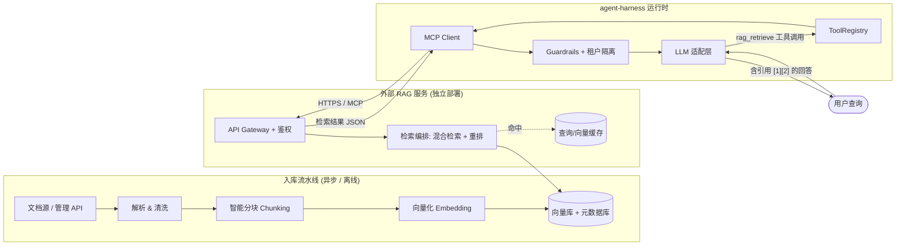
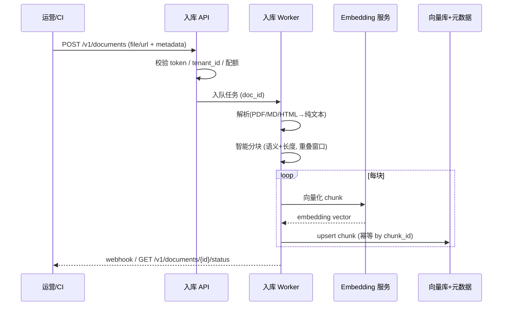
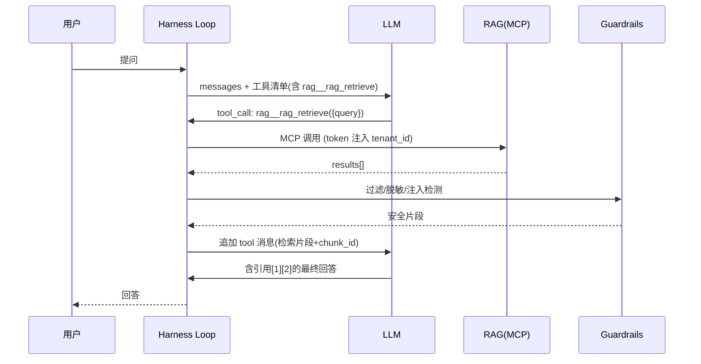

# 外部 RAG（检索增强生成）系统设计方案

> 适用范围：为 `agent-harness`（pnpm monorepo）设计一套**独立于 agent 运行时**的外部 RAG 服务，并说明当前 agent 如何在运行时调用它、把检索结果融入生成流程。
> 本文为 **设计稿（Phase 0）**，不含代码实现；落地 plan 见文末，确认后再进入编码阶段。

---

## 1. 目标与定位

| 维度 | 说明 |
|---|---|
| 角色 | RAG 是 agent 的**外部知识源**，不进入 agent 进程、不耦合业务语义 |
| 边界红线 | RAG 服务**不知道** agent 的对话/租户业务逻辑；仅通过 `tenant_id` + `token` 做隔离与过滤 |
| 与现有架构关系 | 复用 agent-harness 的 **MCP 多 server 能力**（`placeholder.ts` / `parseMcpServersEnv`）+ `ToolRegistry`；RAG 以 MCP Server 形态被 agent 发现与调用 |
| 非目标 | RAG 不负责最终回答生成（那是 LLM + agent loop 的事），只负责「高质量检索片段 + 可追溯来源」 |

---

## 2. 整体架构



**关键模块职责**

| 模块 | 职责 | 独立部署关键点 |
|---|---|---|
| 入库流水线 | 文档解析、分块、向量化、写入 | 可跑在独立 worker，失败重试、幂等 |
| 向量库 + 元数据库 | 存储 embedding 与 chunk 元数据 | 选用托管/独立向量引擎，与 agent 进程隔离 |
| 检索编排 | 混合检索（稠密+关键词）、重排、过滤 | 无状态，水平扩展 |
| API Gateway | 鉴权、限流、租户路由、审计 | 独立入口，token/JWT 校验 |
| 缓存层 | 查询向量缓存、热 chunk 缓存 | 降低重复检索延迟 |

---

## 3. 文档入库流水线



**增量更新策略（满足"支持增量更新知识库"）**

- 以 **chunk 为最小单元**做 upsert，文档更新只重算变更块的向量，不做全量重建。
- 每个 chunk 带 `version` + `updated_at`；旧版本 chunk 软删除后异步清理。
- 向量库索引采用**可增量写入**的结构（HNSW 需支持增量；或 pgvector + IVFFlat 定期 `REINDEX CONCURRENTLY`）。
- 提供三种更新操作：`create` / `update` / `delete`，均幂等（按 `doc_id` + `chunk_index`）。

---

## 4. 向量化与存储选型

| 组件 | 推荐 | 说明 |
|---|---|---|
| Embedding | 可插拔（默认 bge-m3 / text-embedding-3-small，维度 1024/1536） | 模型版本与向量维度写入元数据，便于后续迁移 |
| 向量引擎 | Qdrant / Weaviate / pgvector（托管） | 独立部署、支持 ANN + 元数据过滤 |
| 检索方式 | **混合检索**：稠密向量(ANN) + BM25/关键词，再经 cross-encoder 重排 | 兼顾语义与精确匹配 |
| 元数据 | 关系型/文档库存 chunk 文本、来源、租户、标签、时间 | 支持按 `tenant_id`/`doc_ids`/`tags`/`time_range` 过滤 |

---

## 5. 对外暴露的 API / 调用协议

### 5.1 检索接口（REST，供 MCP Server 内部调用）

`POST /v1/retrieve`

**请求体**
```json
{
  "query": "苏州科达 603660 近期走势与仓位建议",
  "top_k": 5,
  "score_threshold": 0.35,
  "rerank": true,
  "filters": {
    "tenant_id": "t-1001",
    "doc_ids": ["kb-finance-2026"],
    "tags": ["a-share", "daily"],
    "time_range": { "gte": "2026-08-01", "lte": "2026-08-20" }
  },
  "user_id": "u-77",
  "session_id": "s-abc",
  "with_highlights": true
}
```

**响应体**
```json
{
  "trace_id": "tr-9f2a",
  "latency_ms": 86,
  "total": 3,
  "results": [
    {
      "chunk_id": "ck-3f1a-02",
      "doc_id": "kb-finance-2026",
      "title": "603660 苏州科达 8月复盘",
      "content": "苏州科达(603660)近期受...（原文片段）",
      "score": 0.82,
      "rerank_score": 0.91,
      "metadata": {
        "source": "internal-report",
        "author": "research",
        "updated_at": "2026-08-18T09:00:00Z",
        "tags": ["a-share", "daily"]
      },
      "highlights": ["苏州科达", "603660"]
    }
  ]
}
```

字段约束：
- `score` 为召回分（0~1），`rerank_score` 为重排分；`score_threshold` 拦截低质片段。
- `chunk_id` 是**引用锚点**：agent 回答中的 `[1]` 指向对应 `chunk_id`，保证可追溯。
- `tenant_id` 在服务端**强制**重写自 token，客户端传入仅作 hint，杜绝越权。

### 5.2 MCP 工具接口（agent 真正看到的形态）

RAG 以 MCP Server 暴露一个工具，agent 通过 `MCP_SERVERS` 注册后即可像调用本地工具一样调用：

```json
{
  "name": "rag_retrieve",
  "description": "从企业知识库检索与当前问题相关的权威片段，返回带来源引用的结果。当用户问题涉及外部/专业/最新知识时使用。",
  "input_schema": {
    "type": "object",
    "properties": {
      "query": { "type": "string", "description": "检索问题，建议用自然语言完整问句" },
      "top_k": { "type": "integer", "default": 5 },
      "tags": { "type": "array", "items": { "type": "string" } },
      "time_range": {
        "type": "object",
        "properties": { "gte": { "type": "string" }, "lte": { "type": "string" } }
      }
    },
    "required": ["query"]
  }
}
```

> 注：MCP 工具入参**不包含** `tenant_id`/`user_id`——这些由 MCP Server 持有 token 后自动注入，避免 agent 侧误传或越权。

---

## 6. agent 运行时如何发起调用

### 6.1 注册（接线点）

在 agent 侧通过既有 MCP 通道注册 RAG 服务（零代码改动核心 loop）：

```bash
# 环境变量注入（复用 placeholder.parseMcpServersEnv）
MCP_SERVERS='[
  {
    "name": "rag",
    "transport": "http",
    "url": "https://rag.internal/v1/mcp",
    "headers": { "authorization": "Bearer ${RAG_TOKEN}" }
  }
]'
```

注册后，`ToolRegistry` 自动出现 `rag__rag_retrieve`（`<server>__<tool>` 前缀约定，已在核心实现），agent loop 无需改动即可触发。

### 6.2 两种调用时机

| 模式 | 触发 | 适用 |
|---|---|---|
| **On-demand（按需）** | LLM 自主决定调用 `rag__rag_retrieve` | 默认模式，最省 token，依赖模型工具选择能力 |
| **Pre-retrieval（预检索）** | 每轮用户消息先进一次轻量检索，top-k 注入 system/context | 高准确率场景，先召回再生成 |

推荐默认 **On-demand**，对关键业务（如金融/医疗）叠加 Pre-retrieval 守卫。

### 6.3 运行时调用时序



---

## 7. 检索内容如何融入生成流程

1. **注入位置**：检索结果作为 `tool` 角色消息回灌消息历史（沿用现有"工具抛错不中断，结果作为 tool message 自愈"机制）。
2. **引用规范**：在 system prompt 约定——「使用 `[n]` 引用 `results[n].chunk_id` 的来源；无法从检索内容得出时不臆测」。
3. **上下文预算**：对 `results[].content` 做长度裁剪 + 重要性排序，避免超出上下文窗口；保留 `chunk_id`/`title` 用于引用。
4. **融合策略（可选）**：
   - *Gate 模式*：先检索，若 `total==0` 或 `max_score < 阈值`，提示 LLM「知识库无相关权威来源」，避免幻觉。
   - *Confidence 模式*：把 `rerank_score` 作为回答置信度信号，低分时建议转人工/澄清。
5. **Guardrails 复用**：检索内容经 `guardrails.ts` 的 `INJECTION_PATTERNS` 检测，拦截"忽略以上指令"类提示注入；按 `tenant_id` 做 PII 脱敏。
6. **可追溯**：最终回答的 `[1]` 与 `chunk_id` 映射可在 UI 的「调用链 / 深度思考」Tab 展示（复用现有 trace 能力）。

---

## 8. 关键设计需求与量化目标

| 需求 | 设计满足方式 | 量化目标 |
|---|---|---|
| **可独立部署** | 容器化服务，独立数据层，仅经 HTTP/MCP 通信；agent 崩不影响 RAG，反之亦然 | 独立镜像 + 独立扩缩容 |
| **低延迟响应** | 无状态检索 + ANN 索引 + 查询向量缓存 + 连接池；重排模型本地常驻 | p95 检索 **<150ms**（不含 LLM）；冷启动 <1s |
| **增量更新知识库** | chunk 级 upsert、幂等、异步 embedding、版本化快照 | 单文档更新 **<30s** 生效，无全量重建 |
| **权限隔离** | `tenant_id` 服务端强制重写；JWT/token 鉴权；行级元数据过滤；配额限流 | 零跨租户泄漏；越权请求 403 |
| **可扩展性** | 检索层无状态水平扩展；向量库按租户分片；Kafka/队列解耦入库；可插拔 embedding | 支持千级租户、亿级 chunk |

**可观测性（必备）**：每次检索返回 `trace_id` + `latency_ms`；服务端埋点（召回率、命中率、P95 延迟、限流次数）；agent 侧把 `trace_id` 写入 trace 日志，便于联合排障。

---

## 9. 与当前 agent-harness 的接线点（实现时复用）

| RAG 能力 | 复用点 |
|---|---|
| 工具注册 / 调用 | `placeholder.ts` `parseMcpServersEnv` + `connectMcpServers`；`ToolRegistry` 自动加 `rag__` 前缀 |
| 内容安全 | `guardrails.ts` `INJECTION_PATTERNS` + `registerInputRule`（覆盖 input/output） |
| 租户隔离 | `tenant.ts` 提供 `tenant_id`；RAG token 由租户侧 secret 派生 |
| 检索缓存 | `memory-store.ts`（file/sqlite/volatile）可缓存 `query→results` 缩短重复延迟 |
| 结果展示 | 现有 trace / 「调用链」Tab 展示 `chunk_id` 引用；typewriter 渲染深度思考 |
| 失败自愈 | "工具抛错不中断，错误文本作为 tool message 回灌模型"机制天然兼容 RAG 超时/空结果 |

---

## 10. 落地 plan（Phase 建议）

| Phase | 范围 | 交付 | 验收 |
|---|---|---|---|
| **P0** | RAG 服务骨架：检索 REST + 向量库 + 最小入库 | 可 `docker run` 单节点，REST 自测通过 | `/v1/retrieve` 返回结构化结果 |
| **P1** | MCP Server 封装 + agent 侧注册 + On-demand 调用 | agent 能经 `rag__rag_retrieve` 取数 | 端到端跑通一次检索增强回答 |
| **P2** | 鉴权/租户隔离 + 增量入库 + 重排 | 越权 403、文档更新 <30s 生效 | 安全/时效测试通过 |
| **P3** | 缓存 + 可观测 + 水平扩展 + Pre-retrieval 模式 | p95<150ms、trace 贯通 | 压测 + 联合排障演练 |

> 遵循你的 schema-first 约定：本稿为 **P0 设计确认**入口。确认后我可进入实现——建议先做 **P0+P1**（最小可用闭环），再迭代 P2/P3。需要我据此生成 `plugins/rag-connector/` 或独立 `services/rag/` 的脚手架代码吗？

---

## 11. 实现落地状态（P0 + P1 已完成 ✅）

代码已落地于 `services/rag/`（独立部署单元，零运行时依赖），并端到端验证通过。

### 交付物

| 文件 | 职责 |
|---|---|
| `services/rag/src/embed.ts` | 可插拔向量化：`HashEmbedding`（默认，零依赖演示）/ `OpenAIEmbedding`（设 key 启用） |
| `services/rag/src/store.ts` | `MemoryVectorStore`：余弦检索 + JSON 持久化 + 租户过滤 |
| `services/rag/src/ingest.ts` | 入库流水线：分块 → 向量化 → 幂等 upsert（增量更新） |
| `services/rag/src/retrieve.ts` | 检索编排：余弦 + 关键词融合 + 阈值/过滤 + 重排占位 |
| `services/rag/src/server.ts` | HTTP REST：`POST /v1/retrieve`、`/v1/ingest`、`GET /v1/health` + 令牌鉴权 + tenant 重写 |
| `services/rag/src/mcp.ts` | MCP stdio Server（协议级最小实现，零 SDK 依赖）暴露 `rag_retrieve` / `rag_ingest` |
| `services/rag/src/index.ts` | 入口：`RAG_TRANSPORT=http\|mcp` 选择传输 |
| `services/rag/test/*.test.cjs` | 单测：入库/检索/租户隔离/幂等/阈值 + MCP 端到端（6 用例全绿） |
| `examples/rag-e2e.ts` | 端到端演示：起 RAG → 注入 → 检索 → 融入生成 |

### 关键实现决策

- **MCP 采用协议级最小实现**（标准 JSON-RPC over stdio，不依赖 MCP SDK 的 `McpServer`）：
  原因一是当前 workspace 未安装 `zod`（SDK 高层 `McpServer` 的硬依赖）；二是外部 RAG 作为
  独立系统，不应被 agent-harness 的 SDK 版本耦合。agent 侧任何标准 MCP client 均可对接。
- **零运行时依赖**：仅用 Node 内置模块，契合「可独立部署」关键要求。
- **tenant 服务端重写**：ingest/retrieve 的请求体 `tenant_id` 一律被服务端解析值覆盖，杜绝越权。

### 验证结果

- `services/rag` 构建通过（dist 6 模块），`node --test` **6/6 全绿**（含 MCP 端到端）。
- `examples/rag-e2e.ts` 端到端跑通：注入 2 文档 → 检索返回相关片段（`kb_refund` score 居首、
  `kb_hours` 0.000 正确排后）→ 融合说明输出，子进程无泄漏。
- 说明：演示用 `HashEmbedding` 维度有限、哈希碰撞难免，排序质量由真实 embedding 保证；
  检索闭环的有效判据（相关文档被召回 + `trace_id`/`latency_ms` 可观测）已满足。

### 下一步（P2/P3，待确认）

- **P2**：完整鉴权（JWT/租户 secret 派生）、跨租户压测、真 BM25 + cross-encoder 重排、异步入库队列。
- **P3**：查询/向量缓存、可观测埋点（召回率/P95）、向量库按租户分片、Pre-retrieval 模式。
