# 设计文档 · 问答模式 / 计划模式（可切换运行模式）

> 状态：待确认 → 确认后按 Phase 分期实现
> 原则：非侵入式演进 —— core/server/webapp 零业务耦合，复用既有管线（SSE / JobDescriptor 透传先例 / chat session 持久化），拒绝引入新框架。

---

## 1. 模式定义与职责边界

| | 问答模式（qa） | 计划模式（plan） |
|---|---|---|
| **定位** | 即问即答，单次 run 直接产出最终回答（= 现有默认行为） | 先规划后执行：生成结构化计划 → 人工确认 → 按计划逐任务执行 |
| **产出** | 最终答复文本 | 计划实体 + 各任务执行结果 |
| **HITL** | 无 | 强（确认门禁：未确认不执行任何任务） |
| **适用** | 事实查询、解释、短任务 | 多步任务、有依赖链的工作、需要过程可控的场景 |

**职责边界**

```
core (harness.ts)      只认事件流。新增旁路事件 plan:proposed（携带结构化计划 JSON）；
                       不感知「模式」概念，不感知 UI。
server (run-queue)     JobDescriptor 新增可选透传字段 interactionMode / planRef；
                       计划实体落盘到 chat session 存储（复用 appendChatMessage 扩展位先例，
                       与 reasoning/tools/trace 同机制）。不做业务判断。
webapp (chat.ts)       唯一的模式语义持有者：模式切换器 UI、plan 卡片渲染、确认/取消交互、
                       逐任务派发循环。
client (types.ts)      RunInput 新增可选字段（type only，零逻辑）。
```

关键解耦点：**「计划」本身是一次普通 run 的产物**。planner 就是一个带结构化输出约束的系统提示词模板，走完全相同的 submit → execute → SSE 管线。core 无需新执行原语。

## 2. 触发与切换机制

- **P0：用户手动选择**。composer 工具行新增分段切换器 `问答 | 计划`（与既有 agent-select / web 开关同区），状态 `@state() interactionMode: 'qa' | 'plan'`，随 send() 提交。
- **P1（预留）：自动判断**。挂点 = 既有 TaskRouter IntentRouter（LLM 意图分类 + 规则回退）：新增意图维度 `needs_planning`（多步/依赖/交付物类提问 → 建议 plan），仅以「建议横幅」形式呈现（"这个问题适合用计划模式，一键切换？"），**不静默改行为**。
- 会话内记忆所选模式（localStorage per-session），切会话恢复。

## 3. 处理流程差异

```mermaid
sequenceDiagram
    participant U as 用户
    participant W as webapp(chat.ts)
    participant S as server(handleRun)
    participant H as core(harness)

    rect rgb(30,34,48)
    Note over U,H: 问答模式（现状不变）
    U->>W: 发送问题
    W->>S: POST /run {prompt}
    S->>H: submit(job)
    H-->>S: llm:token... run:end
    S-->>W: SSE 事件流
    W-->>U: 流式最终回答
    end

    rect rgb(40,32,52)
    Note over U,H: 计划模式（两阶段）
    U->>W: 发送需求（plan 模式）
    W->>S: POST /run {prompt, interactionMode:'plan', phase:'propose'}
    S->>H: planner prompt（JSON Schema 约束输出）
    H-->>S: plan:proposed {plan JSON} + run:end
    S-->>W: SSE（plan 实体随事件下发并落盘会话存储）
    W-->>U: 渲染计划卡片（任务拆解/顺序/依赖/预期产出 + 确认·编辑·取消）
    U->>W: 确认（或编辑后确认）
    loop 逐任务（拓扑序，依赖就绪才派发）
        W->>S: POST /run {executePlan:{planId,taskIds:[t]}, chatSessionId}
        S->>H: 普通 run（上下文含已完成任务结果摘要）
        H-->>W: 该任务的事件流 + 结果
    end
    W-->>U: 任务级进度 + 汇总
    end
```



**计划 Schema（planner 结构化输出契约）**

```jsonc
{
  "goal": "string",
  "tasks": [
    {
      "id": "t1",
      "title": "string",
      "steps": ["string"],          // 任务内步骤
      "dependsOn": ["t0"],          // DAG 依赖
      "expectedOutput": "string"
    }
  ]
}
```

前端按 dependsOn 做拓扑排序决定派发顺序；环依赖由 planner 提示词禁止 + 前端校验兜底（检出则提示重新生成）。

## 4. 改动范围（审计表）

| 层 | 文件 | 改动 | 侵入度 |
|---|---|---|---|
| core | `harness.ts` | `HarnessEvent` 加 `plan:proposed`（旁路）；新增 planner 系统提示词常量 + `extractPlanJson()` 解析容错 | 低 |
| server | `run-queue.ts` | `JobDescriptor`/`submit`/`makeJob` 透传 `interactionMode?`、`planPhase?`（沿用 `web?: boolean` 的既有透传先例） | 低 |
| server | `server.ts` | handleRun 读取并透传两个字段；plan 落盘复用 chat session 存储（消息 meta 扩展位，与 trace 同机制） | 低 |
| client | `types.ts` | `RunInput` 加 `interactionMode?` / `phase?` / `executePlan?`（type only） | 零逻辑 |
| webapp | `chat.ts` | 模式分段切换器、plan 卡片组件（渲染+确认+编辑）、逐任务派发循环（复用断线续传引擎）、`interactionMode` 持久化 | 中 |
| 配置 | env | 无新增必需配置；`PLAN_MODE`（默认 on）可关 | — |

**明确不改**：鉴权/审批、记忆后端、MCP、插件体系、TaskRouter 路由逻辑、断线续传引擎。

## 5. 兼容性与扩展性保证

1. **向后兼容**：所有新字段可选、缺省 = qa = 现状；旧客户端不带 `interactionMode` 行为完全不变；`pnpm -r test/build` 全绿为验收门槛。
2. **模式注册表模式**：`ChatInteractionMode = 'qa' | 'plan'` + 服务端白名单校验（非法值回退 qa）。未来新模式（如 deep-research / workflow 模式）只需：类型联合加一项 + 白名单加一项 + webapp 切换器数组加一项 + 对应 phase 分支，无横向改动。
3. **低耦合**：模式语义收敛在 webapp；core 只增加一个旁路事件与一个纯函数解析器；server 只做透传与落盘。插件 agent 不受影响（assembleAgent 签名不变）。
4. **断线续传天然覆盖**：计划生成的 run 与每个任务的执行 run 都是普通 job，上一轮落地的 jobId+seq 续传引擎直接生效，无需额外处理。

## 6. 分期计划

| Phase | 内容 | 验收 |
|---|---|---|
| P0.1 | core：plan:proposed 事件 + planner 提示词/解析 + 单测 | tsc + node --test |
| P0.2 | server：字段透传 + plan 落盘 | tsc + e2e 脚本（mock 模式全流程） |
| P0.3 | webapp：切换器 + plan 卡片 + 确认/逐任务执行 + 断线续传联动 | tsc + vite build + 手动截图反馈 |
| P1 | 自动判断建议横幅（挂 TaskRouter） | 另立设计 |
