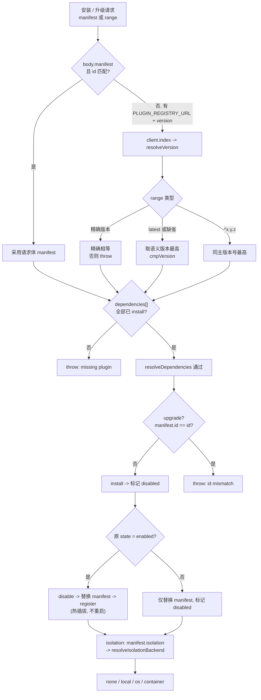

# 插件依赖 / 版本兼容 ER 图与解析规则

> 本文档基于**已落地代码**（`packages/core/src/plugin/*`、`packages/core/src/agents/*`、
> `packages/server/src/plugin-{bootstrap,ext}.ts`、`packages/webapp/src/plugin-ui-registry.ts`）
> 抽取实体关系与版本/依赖解析契约。所有字段名与类型均对齐真实源码，非设计假设。

## 1. 实体关系图（ER）

```mermaid
erDiagram
  PLUGIN_MANIFEST {
    string id PK
    string version
    string name
    string transport
    string endpoint
    string entry
    string domain
    string isolation
  }
  PLUGIN_MODULE {
    PluginManifest manifest
    setup ctx
    onStart ctx
    onStop ctx
    onUnload ctx
  }
  PLUGIN_RECORD {
    PluginManifest manifest
    string state
    number installedAt
    number upgradedAt
  }
  PLUGIN_LOADER {
    Map plugins
    Map modules
    Map contexts
    AgentRegistry registry
  }
  PLUGIN_CONTEXT {
    string pluginId
    PluginManifest manifest
    ToolRegistry tools
    AgentRegistry agentRegistry
    ServerExtensionHost server
    WebExtensionHost web
  }
  PLUGIN_TOOL_REGISTRY {
    ToolRegistry shared
  }
  AGENT_REGISTRY {
    Map capIndex
    Map cache
    AgentStore store
  }
  AGENT_CARD {
    string id PK
    string name
    string domain
    string transport
    string version
    AgentHealth health
    AgentAssembly assembly
  }
  AGENT_CAPABILITY {
    string id PK
    string version
    inputSchema
    outputSchema
  }
  AGENT_ASSEMBLY {
    string systemPrompt
    string skills
    string mcpServers
    string tools
    string defaultMode
  }
  SERVER_PLUGIN_HOST {
    Map routes
    listeners
  }
  WEB_PLUGIN_HOST {
    PluginUIView views
  }
  PLUGIN_UI_VIEW {
    string tabId PK
    string label
    string render
  }
  PLUGIN_REGISTRY_CLIENT {
    string registryUrl
  }
  REGISTRY_ENTRY {
    string id
    string version
    string signature
    string publishedAt
  }
  REGISTRY_INDEX {
    RegistryEntry plugins
  }

  PLUGIN_MODULE ||--|| PLUGIN_MANIFEST : "module.manifest 1:1"
  PLUGIN_RECORD ||--|| PLUGIN_MANIFEST : "rec.manifest 1:1"
  PLUGIN_LOADER ||--o{ PLUGIN_RECORD : "plugins map 1:*"
  PLUGIN_LOADER ||--o{ PLUGIN_MODULE : "modules map 1:*"
  PLUGIN_LOADER ||--o{ PLUGIN_CONTEXT : "contexts map 1:*"
  PLUGIN_LOADER ||--|| AGENT_REGISTRY : "共享单例 getAgentRegistry"
  PLUGIN_LOADER ||--o{ AGENT_CARD : "toAgentCard() 1:*"
  PLUGIN_CONTEXT ||--|| PLUGIN_MANIFEST : "buildContext 持有"
  PLUGIN_CONTEXT ||--o{ PLUGIN_TOOL_REGISTRY : "merge 前缀 pluginId__"
  PLUGIN_CONTEXT ||--o{ SERVER_PLUGIN_HOST : "registerExtension 路由键 pluginId"
  PLUGIN_CONTEXT ||--o{ WEB_PLUGIN_HOST : "registerView 注册 Tab"
  AGENT_REGISTRY ||--o{ AGENT_CARD : "register() 1:*"
  AGENT_CARD ||--o{ AGENT_CAPABILITY : "capabilities 1:*"
  AGENT_CARD ||--o| AGENT_ASSEMBLY : "assembly 0..1"
  PLUGIN_MANIFEST ||--o{ AGENT_CAPABILITY : "capabilities[] 1:*"
  PLUGIN_MANIFEST ||--o| AGENT_ASSEMBLY : "assembly? 0..1"
  PLUGIN_MANIFEST }o--o{ PLUGIN_MANIFEST : "dependencies[] id->id"
  AGENT_REGISTRY ||--o{ AGENT_CAPABILITY : "capIndex 倒排 capId->Set agentId"
  WEB_PLUGIN_HOST ||--o{ PLUGIN_UI_VIEW : "views 1:*"
  PLUGIN_REGISTRY_CLIENT ||--o{ REGISTRY_ENTRY : "index 1:*"
  REGISTRY_ENTRY ||--|| PLUGIN_MANIFEST : "manifest 1:1"
  PLUGIN_REGISTRY_CLIENT ||--o{ PLUGIN_LOADER : "installFromRegistry->install"
```

### 1.1 关系说明（数组/集合类，未在主图连线，避免连线爆炸）

| 关系 | 含义 | 代码位置 |
| --- | --- | --- |
| `PluginManifest.capabilities: AgentCapability[]` | 能力声明数组，启用时转成 AgentCard.capabilities | `manifest.ts` |
| `PluginManifest.dependencies?: string[]` | 依赖的其它插件 id；启用前经 `resolveDependencies` 校验 | `loader.ts:resolveDependencies` |
| `PluginManifest.assembly?: AgentAssembly` | 系统提示词/技能/MCP/工具面收窄，经 `toAgentCard` 透传到 AgentCard.assembly | `loader.ts:toAgentCard` |
| `AgentRegistry.capIndex: Map<capId, Set<agentId>>` | 能力 → agent 倒排索引，O(1) 按能力发现；多插件声明同 capId 时集合共存 | `registry.ts` |
| `getPluginToolRegistry()` 共享表 | 所有插件 `ctx.tools` 合并进来（前缀 `${pluginId}__`），`runner.assembleAgent` 统一 mergeFrom | `context.ts:getPluginToolRegistry` |

### 1.2 关键不变量（架构红线）

- `pluginId === agentId === AgentCard.id`：插件经 `toAgentCard` 注册进**共享** `AgentRegistry`，与核心 agent 走同一条路由/编排/A2A 路径。
- core/server/webapp 三层**零业务词**：上图中所有实体均为平台通用原语，业务语义（客服/退款/FAQ）只存在于 `plugins/*` 包内的 `PluginModule` 实现。
- 插件只**调用** `PluginContext` 暴露的公共 API，从不 import/修改 core 源码。

## 2. 版本 / 依赖解析流图（Phase 4）



## 3. 版本 / 依赖兼容性矩阵

| 约束 | 解析规则 | 失败行为 | 代码位置 |
| --- | --- | --- | --- |
| `dependencies[]` | 每个 id 必须已 `install` | throw `missing plugin` | `loader.resolveDependencies` |
| range = `latest` / 缺省 | 取语义版本最高 | — | `registry.resolveVersion` |
| range = `^x.y.z` | 同主版本号最高 | throw `no version matching` | `registry.resolveVersion` |
| range = 精确版本 | 精确相等 | throw `version not found` | `registry.resolveVersion` |
| `upgrade` id | `manifest.id` 须等于插件 id | throw `id mismatch` | `loader.upgrade` |
| capability 冲突 | 多插件同 capId → `capIndex` 集合共存 | 不冲突；router 按 score 选 | `AgentRegistry.capIndex` |
| isolation | `manifest.isolation` → `resolveIsolationBackend` 收敛 | —（声明级，远端插件应声明 os/container） | `loader.toAgentCard` |
| assembly | 仅原样透传 `AgentAssembly` | — | `loader.toAgentCard` |

### 3.1 热升级的边界（如实记录）

- `upgrade` 是「**manifest 替换 + 按原启用态重注册**」：进程内 `PluginModule` 代码**不热替换**。
  真正代码热升级需 `uninstall` + 重新 `installModule` + `enable`，或重启进程。
- 单会话 `read-modify-write` 在跨副本极端并发下可能互相覆盖（低概率）；强一致需后续换 Redis 后端。
- 版本比较用 `cmpVersion`（点分数字段，非数字按 0），不支持 prerelease 标签。

## 4. 端到端验证命令（需在可装依赖环境执行；沙箱受限）

```bash
# 1) 拓扑构建（core -> server/webapp/插件）
pnpm -r build

# 2) 起 server（默认启用 plugins/customer-service）
MEMORY_BACKEND=file MEMORY_DIR=/app/data/memory node packages/server/dist/server.js

# 3) 查看插件元数据（应返回 customer-service + version + views）
curl -s localhost:8080/api/plugins | head -c 800; echo

# 4) 热插拔：停用 / 启用 / 升级（受 plugin:manage 保护，需 Bearer 令牌）
curl -X POST localhost:8080/api/plugins/customer-service/disable -H "authorization: Bearer $UI_AUTH_TOKEN"
curl -X POST localhost:8080/api/plugins/customer-service/enable  -H "authorization: Bearer $UI_AUTH_TOKEN"

# 5) 端到端多轮对话（mock LLM）由 server 现有 /api/run SSE 覆盖，无需新增端点
```

> 沙箱 `pnpm install` 被安全守卫拦截、无 `tsc`，本环境无法编译校验；上述改动按 core 公共 API 严格手写类型，
> 请在有依赖环境跑 `pnpm -r build` 验证（Phase 0–4 全部改动）。
